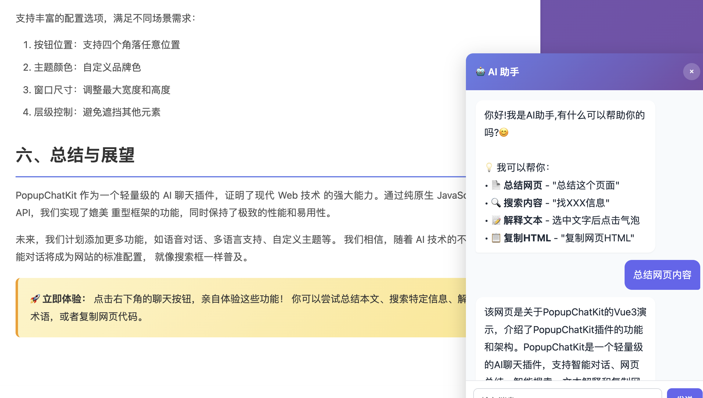

# 🚀 PopupChatKit

<div align="center">

**一个轻量级、零依赖的 AI 聊天插件**  
让任何网站瞬间拥有智能对话能力

[](https://opensource.org/licenses/MIT)
[](https://www.python.org/downloads/)
[](https://fastapi.tiangolo.com/)
[](https://open.bigmodel.cn/)

</div>

---

## 📖 目录

- [✨ 核心特性](#-核心特性)
- [🎯 双模式设计](#-双模式设计)
- [🛠️ 技术栈](#️-技术栈)
- [📦 快速开始](#-快速开始)
- [� 使用演示](#-使用演示)
- [🔧 配置说明](#-配置说明)
- [📚 API 文档](#-api-文档)

---

## ✨ 核心特性

### 💬 智能对话系统
- **流式响应** - 打字机效果，实时展示 AI 回复
- **上下文记忆** - 基于 SQLite 的完整会话管理
- **多模型支持** - 集成智谱 AI (GLM-4-flashx)
- **工具调用** - 支持 Function Call 和 MCP 协议

### 🎨 多模态能力
- **AI 绘图** - CogView-4 模型，文本生成精美图片
- **图片识别** - GLM-4V-Flash 视觉分析
- **智能天气** - 实时查询全国城市天气（高德地图 API）
- **数学计算** - MCP 工具，精确计算数学表达式

### � 用户体验
- **零依赖** - 前端纯原生 JavaScript（约 700 行）
- **响应式设计** - 完美适配桌面端和移动端
- **高度可定制** - 丰富的配置选项和主题定制
- **一键集成** - 一行代码嵌入任何网站

---

## 🎯 双模式设计

<div align="center">

| 模式 | 特点 | 适用场景 |
|:---:|:---|:---|
| 🌐 **独立模式** | 完整 Web 应用 | 独立部署、后台管理 |
| 🔌 **嵌入模式** | 轻量级插件 | 网站集成、客服助手 |

</div>

### 🌐 独立模式（Standalone）

完整的 AI 对话 Web 应用，提供：

- ✅ 智能对话 - 多轮对话，上下文理解
- ✅ AI 绘图 - 描述生成图片
- ✅ 图片识别 - 上传图片分析
- ✅ 会话管理 - 历史记录、多会话切换
- ✅ 工具调用 - 天气查询、计算等
- ✅ 会话删除 - 管理历史记录


*独立模式：Function Call 工具调用展示（天气查询）*


*独立模式：AI 绘图功能展示*

### 🔌 嵌入模式（Embedded）

轻量级插件，一行代码集成到任何网站：

- 📄 **网页总结** - 输入"总结这个页面"自动提取内容
- 🔍 **智能搜索** - "找配置选项"快速定位信息
- 📝 **文本解释** - 选中文字点击气泡即可解释（无需手动输入！）
- 📋 **复制HTML** - 输入"复制网页HTML"导出代码
- 💬 **悬浮按钮** - 右下角可拖拽、可定制样式


*嵌入模式：选中文本智能解释功能*

---

## 🛠️ 技术栈

### 后端
- **框架**: FastAPI 0.109+ (高性能异步)
- **AI框架**: pydantic-ai 0.0.7+ (智能 Agent 管理)
- **LLM**: 智谱 AI (GLM-4-flashx, CogView-4, GLM-4V-Flash)
- **数据库**: SQLite (WAL 模式，异步操作)
- **工具协议**: Function Call + MCP (Model Context Protocol)
- **包管理**: uv (快速依赖安装)

### 前端
- **语言**: 纯原生 JavaScript (零依赖)
- **模式**: IIFE 封装，全局暴露 `PopupChatKit`
- **特性**: 流式响应、Markdown 渲染、代码高亮
- **样式**: 响应式 CSS，支持自定义主题

### 工具集成
- **天气查询**: 高德地图 API (Function Call)
- **数学计算**: FastMCP (MCP 协议)
- **未来扩展**: 搜索、翻译、文件操作等

---

## 📦 快速开始

### 前置要求

- Python 3.10+
- [智谱 AI API Key](https://open.bigmodel.cn/) (必需)
- [高德地图 API Key](https://lbs.amap.com/) (可选，用于天气查询)

### 1. 克隆项目

```bash
git clone https://github.com/yourusername/PopupChatKit.git
cd PopupChatKit
```

### 2. 配置环境

创建 `backend/.env` 文件：

```bash
# 智谱 AI API Key（必填）
ZHIPU_API_KEY=your_zhipu_api_key_here

# OpenAI 兼容接口基础 URL
OPENAI_BASE_URL=https://open.bigmodel.cn/api/paas/v4

# 高德地图 API Key（可选，用于天气查询）
GAODE_API_KEY=your_gaode_api_key_here
```

**获取 API Key**:
- 智谱 AI: https://open.bigmodel.cn/
- 高德地图: https://lbs.amap.com/

### 3. 安装依赖

**使用 uv（推荐，更快）**:

```bash
cd backend
uv sync
```

### 4. 初始化数据库

首次运行会自动创建数据库：

```bash
cd backend
uv run python
```

### 5. 启动服务

```bash
cd backend

# 使用 uv
uv run uvicorn main.py

服务启动后，访问：
- 🌐 独立模式: http://localhost:8000
- 📄 API 文档: http://localhost:8000/docs
- 🔌 嵌入演示: 打开 `frontend/embedded/demo.html`

---

## � 使用演示

### 独立模式 - 完整 Web 应用

访问 http://localhost:8000，体验完整功能：

#### 1. 智能对话
```
用户：北京今天天气怎么样？
AI：📍 北京的天气：
    🌡️ 天气：晴
    🌡️ 温度：20°C
    💧 湿度：45%
    🌬️ 风向：东北
    💨 风力：3级
```

#### 2. AI 绘图
```
用户：画一只可爱的小猫
AI：[生成精美猫咪图片]
```

#### 3. 数学计算
```
用户：计算 123 + 456
AI：579
```

### 嵌入模式 - 插件集成

在任何 HTML 页面添加：

```html
<!DOCTYPE html>
<html>
<head>
    <title>我的网站</title>
</head>
<body>
    <h1>欢迎访问我的网站</h1>
    
    <!-- 引入 PopupChatKit 插件 -->
    <script src="http://localhost:8000/embedded/popup.js"></script>
    
    <!-- 初始化插件 -->
    <script>
        PopupChatKit.init({
            apiBase: 'http://localhost:8000/api',
            position: 'bottom-right',  // 位置：bottom-right, bottom-left, top-right, top-left
            buttonColor: '#6366f1',    // 按钮颜色
            maxWidth: 400,             // 聊天窗口宽度
            maxHeight: 600             // 聊天窗口高度
        });
    </script>
</body>
</html>
```

#### 嵌入模式智能功能

1. **网页总结** - 自动提取页面内容
   ```
   用户：总结这个页面
   AI：[自动提取并总结当前网页内容]
   ```

2. **智能搜索** - 快速查找信息
   ```
   用户：找快速开始的方法
   AI：[在页面中搜索并返回相关内容]
   ```

3. **文本解释** - 选中即解释 ⭐ 特色功能
   - 用鼠标选中任意文字
   - 自动出现"💡 点击解释这段文字"气泡
   - **点击气泡**即可自动发送，无需手动输入！

4. **复制HTML** - 导出网页代码
   ```
   用户：复制网页HTML
   AI：[将完整HTML代码复制到剪贴板]
   ```

---

## 🔧 配置说明

### 后端配置（.env）

```bash
# ============================================
# 必填配置
# ============================================

# 智谱 AI API Key
ZHIPU_API_KEY=your_api_key_here

# OpenAI 兼容接口地址
OPENAI_BASE_URL=https://open.bigmodel.cn/api/paas/v4

# ============================================
# 可选配置
# ============================================

# 高德地图 API Key（用于天气查询工具）
GAODE_API_KEY=your_gaode_key_here

# 服务器配置
HOST=0.0.0.0
PORT=8000

# 数据库路径
DATABASE_PATH=../data/chat.db
```

### 前端配置

```javascript
PopupChatKit.init({
    // API 基础地址（必填）
    apiBase: 'http://localhost:8000/api',
    
    // 悬浮按钮位置（可选）
    // 选项: 'bottom-right', 'bottom-left', 'top-right', 'top-left'
    position: 'bottom-right',
    
    // 按钮大小（可选，像素）
    buttonSize: 60,
    
    // 按钮颜色（可选）
    buttonColor: '#6366f1',
    
    // 聊天窗口最大宽度（可选，像素）
    maxWidth: 400,
    
    // 聊天窗口最大高度（可选，像素）
    maxHeight: 600,
    
    // 层级（可选）
    zIndex: 9999
});
```

---

## 📚 API 文档

### 核心端点

#### 1. 会话管理

```http
# 创建新会话
POST /api/sessions
Content-Type: application/json

{
  "title": "新对话",
  "mode": "standalone"  // standalone | embedded
}

# 获取会话列表
GET /api/sessions?limit=50

# 获取单个会话
GET /api/sessions/{session_id}

# 删除会话
DELETE /api/sessions/{session_id}
```

#### 2. 聊天对话

```http
# 流式对话（Server-Sent Events）
POST /api/chat/stream
Content-Type: application/json

{
  "session_id": "uuid",
  "message": "你好",
  "context": {
    "mode": "chat"
  }
}

# 获取历史消息
GET /api/chat/history/{session_id}
```

#### 3. AI 绘图

```http
# 生成图片
POST /api/draw
Content-Type: application/json

{
  "prompt": "一只可爱的小猫",
  "session_id": "uuid",
  "model": "cogview-4-250304",
  "size": "1024x1024",
  "quality": "standard"
}
```

#### 4. 图片识别

```http
# 分析图片
POST /api/image/analyze
Content-Type: multipart/form-data

image: [file]
prompt: "这是什么？"
session_id: "uuid"
```

### 响应格式

**成功响应**:
```json
{
  "success": true,
  "data": {...}
}
```

**错误响应**:
```json
{
  "error": "错误信息",
  "detail": "详细描述"
}
```

完整 API 文档: http://localhost:8000/docs

---

## 📁 项目结构

```
PopupChatKit/
├── backend/                 # 后端服务
│   ├── main.py             # FastAPI 主应用（681行）
│   ├── agents.py           # AI Agent 配置（支持工具调用）
│   ├── database.py         # SQLite 数据库操作
│   ├── pyproject.toml      # 项目依赖配置（uv）
│   └── .env.example        # 环境变量模板
├── frontend/
│   ├── standalone/         # 独立模式
│   │   └── chat.html       # 完整 Web 应用
│   └── embedded/           # 嵌入模式
│       ├── popup.js        # 核心插件（~700行，零依赖）
│       ├── demo.html       # 演示页面
│       └── simple.html     # 最简示例
├── 演示/
│   └── vue-demo.html       # Vue3 集成示例
├── public/                 # 静态资源
│   ├── 嵌入.png
│   ├── 工具使用.png
│   └── 绘图.png
├── data/                   # 数据库目录
│   └── chat.db             # SQLite 数据库
├── README.md               # 本文件
├── TECHNICAL_SUMMARY.md    # 技术文档
└── LICENSE                 # MIT 许可证
```

---

## 🔬 技术亮点

### 1. Function Call 工具系统

支持智能工具调用，例如天气查询：

```python
@zhipu_agent.tool
async def get_weather(ctx: RunContext[None], city: str) -> str:
    """获取指定城市的天气信息"""
    # 1. 通过高德地图 API 获取城市编码
    city_code = await get_city_code(city)
    
    # 2. 查询天气信息
    weather_data = await fetch_weather(city_code)
    
    # 3. 格式化返回
    return format_weather_result(weather_data)
```

AI 会自动识别用户意图并调用相应工具。

### 2. MCP 协议集成

使用 FastMCP 实现工具扩展：

```python
from fastmcp import FastMCP

fastmcp_server = FastMCP('calculator')

@fastmcp_server.tool()
async def add(a: int, b: int) -> int:
    """计算两个整数的和"""
    return a + b
```

### 3. 流式响应优化

前端实现打字机效果：

```javascript
const response = await fetch('/api/chat/stream', {
    method: 'POST',
    body: JSON.stringify({...})
});

const reader = response.body.getReader();
const decoder = new TextDecoder();

while (true) {
    const {done, value} = await reader.read();
    if (done) break;
    
    const text = decoder.decode(value);
    updateMessage(text);  // 逐字显示
}
```

---

## 📄 许可证

本项目采用 [MIT License](LICENSE) 开源。

---

## 🙏 致谢

- [智谱 AI](https://open.bigmodel.cn/) - 提供强大的 LLM 能力
- [FastAPI](https://fastapi.tiangolo.com/) - 现代化的 Python Web 框架
- [pydantic-ai](https://github.com/pydantic/pydantic-ai) - 优雅的 AI Agent 框架
- [高德地图](https://lbs.amap.com/) - 提供天气查询 API

---

<div align="center">

**⭐ 如果这个项目对你有帮助，请给个 Star！**

Made with ❤️ by PopupChatKit Team

</div>
